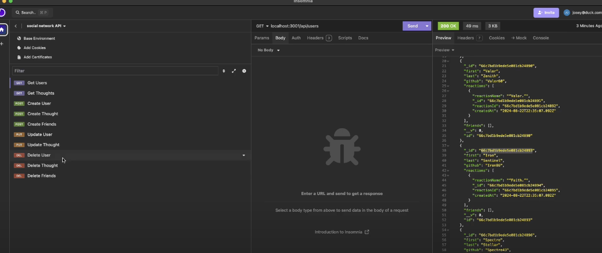

<div align="Center">
    <a href="https://opensource.org/licenses/MIT"></a>
</div>

# social-network-API

<details>
<summary>Table of Contents</summary>

* [Initial Setup](#initial-setup)
* [Project Setup](#project-setup)
* [Languages](#languages)
* [Contribution](#contribution)

</details>

   ## Description
  A social networking site to post thoughts, add reactions, and create your username

  ## License
  This project is licensed under the [MIT](https://opensource.org/licenses/MIT) license.


# Initial setup

1. To begin working with this project, you need to have several essential tools installed on your system. Follow these steps to install the necessary tools:

2. Install Visual Studio Code
-Visual Studio Code (VS Code) is a powerful code editor that provides many features to aid in development.
-Download and install Visual Studio Code from [here](https://code.visualstudio.com/Download).
-Follow the installation instructions for your operating system.

3. Install Git (if on Windows)
-Git is a version control system that helps track changes in your code and collaborate with others.

4. Download and install Git from [here](https://git-scm.com/downloads).
-Follow the installation instructions for your operating system.

5. Install Node.js
-Node.js is a JavaScript runtime that allows you to run JavaScript code outside of a browser.
-Download and install Node.js from [here](https://nodejs.org/en).
-Follow the installation instructions for your operating system.

# Project setup

1. [Clone the project repository](https://docs.github.com/en/repositories/creating-and-managing-repositories/cloning-a-repository)

## To use the application:
1. Open a terminal window.
2. Navigate to the directory where the application is located (server.js).
3. Run the application using its command ```npm i```, so that it can install all of its dependancies

# Languages
HTML, CSS, JavaScript

# Contribution
Want to improve this project? Great! We encourage contribution to make this project even better. Here are some ways you can contribute:
- Report Bugs: If you find any issues, please report them.
- Suggest feautures: Do you have an idea for a new feature? Share it with us!
- Contribute code: If you have programming skills, feel free to contribute code to the project.
- Provide feedback: Your feedback on the project is valuable. Let us know what you think!

Link to [YouTube](https://www.youtube.com/watch?v=j8khovpKqyU) video

## Contact Me

- Jose's [Portfolio](https://uwttn.github.io/portfolio/)
- GitHub: [uwttn](https://github.com/uwttn)
- LinkedIn: [uwttn](https://www.linkedin.com/in/uwttn)